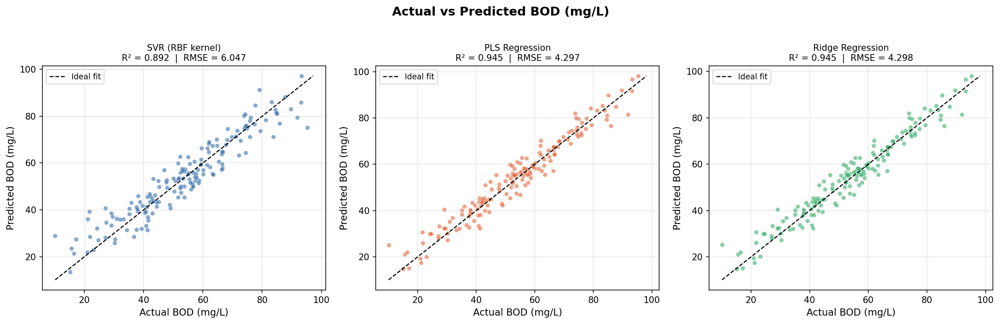
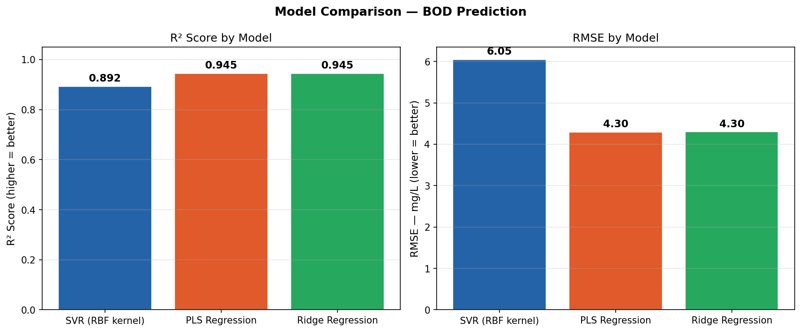
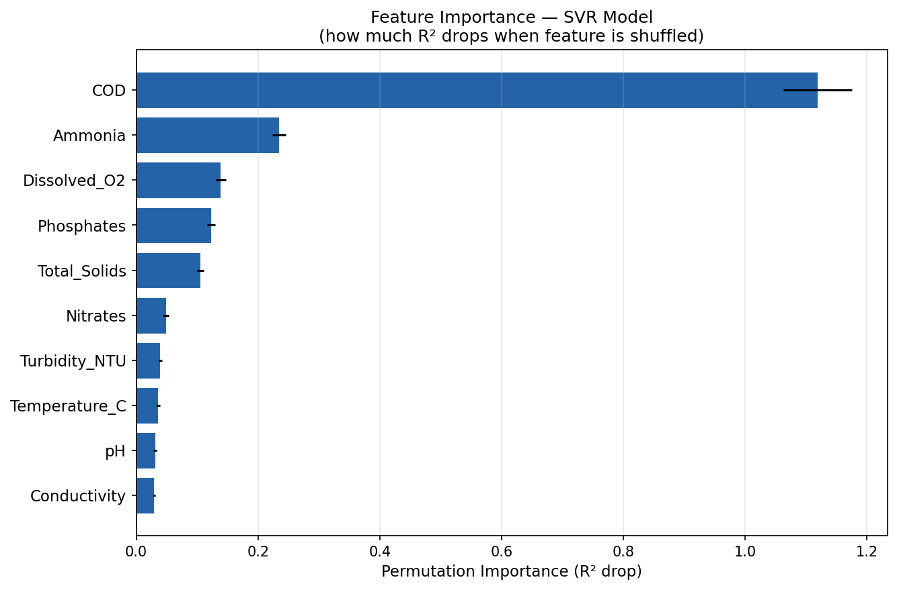
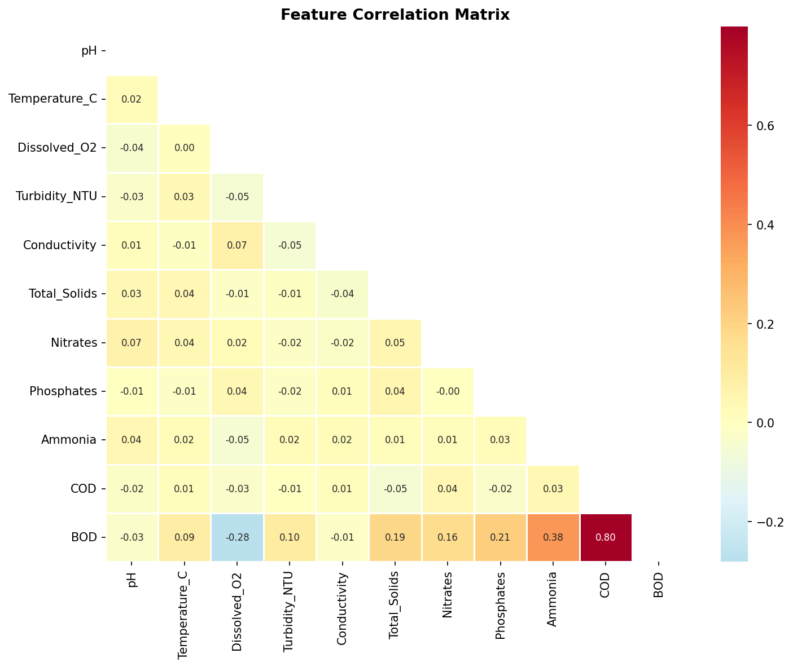

# 💧 River Water BOD Predictor

> Predict **Biochemical Oxygen Demand (BOD)** from 10 observable water quality parameters using machine learning — replacing expensive 5-day lab tests with an instant prediction.


---

## 🔍 What is BOD and why does it matter?

**Biochemical Oxygen Demand (BOD)** measures how much dissolved oxygen microorganisms consume while decomposing organic matter in water. It is the primary indicator of organic pollution in rivers and surface water systems.

- **BOD < 6 mg/L** → Clean, suitable for drinking (with treatment)
- **BOD 6–20 mg/L** → Moderately clean, suitable for aquatic life
- **BOD 20–50 mg/L** → Polluted, treatment required
- **BOD > 50 mg/L** → Heavily polluted, major remediation needed

Conventional BOD testing (BOD₅) requires **5 days** and expensive lab equipment. This project predicts BOD **instantly** from 10 parameters measurable in the field.

---

## 🚀 Quick Start

```bash
# 1. Clone the repo
git clone https://github.com/your-username/bod-predictor.git
cd bod-predictor

# 2. Install dependencies
pip install -r requirements.txt

# 3. Generate dataset
python data/generate_dataset.py

# 4. Train all models
python train_models.py

# 5. Launch the web app
streamlit run app/streamlit_app.py
```

---

## 📁 Project Structure

```
bod-predictor/
│
├── data/
│   ├── generate_dataset.py     # Synthetic dataset generator
│   └── river_water_quality.csv # Generated dataset (800 samples × 11 features)
│
├── models/
│   ├── best_model.pkl          # Saved best model (auto-generated)
│   └── feature_names.pkl       # Feature list for the app
│
├── plots/                      # Auto-generated evaluation plots
│   ├── actual_vs_predicted.png
│   ├── model_comparison.png
│   ├── feature_importance.png
│   └── correlation_heatmap.png
│
├── app/
│   └── streamlit_app.py        # Interactive web app
│
├── train_models.py             # Full ML training pipeline
├── requirements.txt
└── README.md
```

---

## 🤖 Models Compared

| Model | R² Score | RMSE (mg/L) | CV R² (5-fold) |
|-------|----------|-------------|----------------|
| SVR (RBF kernel) | 0.892 | 6.05 | 0.865 |
| **PLS Regression** ✅ | **0.945** | **4.30** | **0.945** |
| Ridge Regression | 0.945 | 4.30 | 0.945 |

**PLS Regression** performed best — which makes domain sense because water quality parameters are highly correlated (multicollinearity), and PLS is specifically designed to handle this.

---

## 📊 Input Features

| Feature | Unit | Why it matters |
|---------|------|----------------|
| pH | — | Affects microbial activity and organic decomposition rate |
| Temperature | °C | Higher temperature → faster BOD consumption |
| Dissolved Oxygen | mg/L | Inversely correlated with BOD |
| Turbidity | NTU | Proxy for suspended organic matter |
| Conductivity | µS/cm | Indicates dissolved ion load |
| Total Dissolved Solids | mg/L | Overall dissolved matter |
| Nitrates | mg/L | Nutrient load indicator |
| Phosphates | mg/L | Key driver of eutrophication |
| Ammonia | mg/L | Strong predictor of organic waste input |
| COD | mg/L | Chemical Oxygen Demand — highly correlated with BOD |

---

## 📈 Results

### Actual vs Predicted BOD


### Model Comparison


### Feature Importance (SVR — Permutation)


### Correlation Heatmap


---

## 🧠 Key Learnings

1. **PLS outperforms SVR** on this dataset because of multicollinearity among input features — a common challenge in environmental datasets
2. **COD and Ammonia** are the strongest predictors of BOD — consistent with domain knowledge
3. **Dissolved Oxygen** is negatively correlated with BOD as expected — model captures this correctly
4. Training a pipeline with `StandardScaler` inside the `Pipeline` object prevents data leakage during cross-validation

---

## 📚 References

- BVS Praveen, Raj Kumar Verma et al., *Advanced Techniques for Water Quality Data Management Using Machine Learning*, in: *Machine Learning in Water Treatment*, Wiley, 2025
- WHO Guidelines for Drinking-water Quality, 4th Ed., 2022
- Scikit-learn documentation: SVR, PLSRegression, permutation_importance

---

## 👤 Author

**B.V.S. Praveen**  
Ph.D. — Indian Institute of Technology Madras  
M.Tech — Indian Institute of Technology Kharagpur  
[Google Scholar](https://scholar.google.com/citations?user=QWW0uwwAAAAJ) · [LinkedIn](#)

---

## 📄 License

MIT License — free to use, modify, and distribute.
